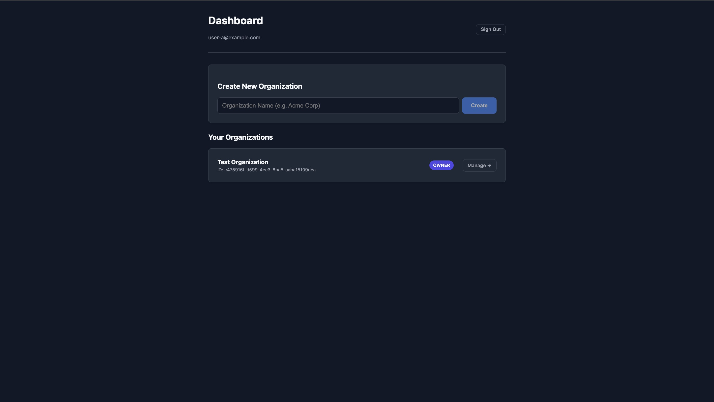
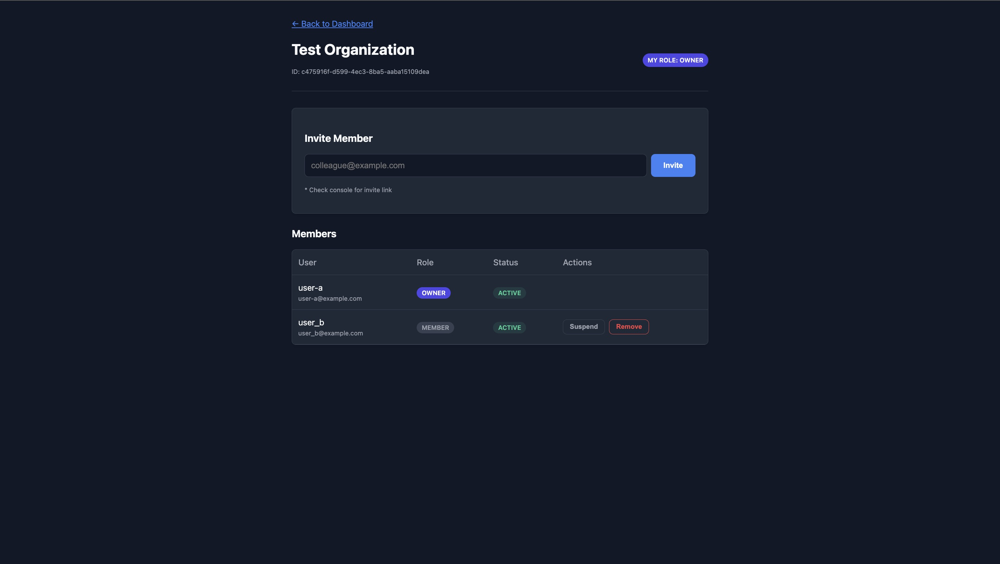
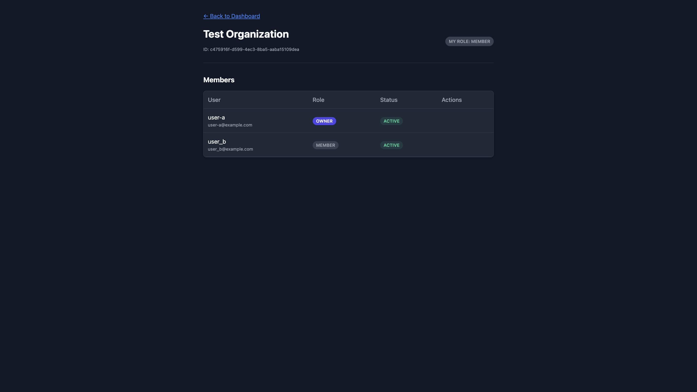
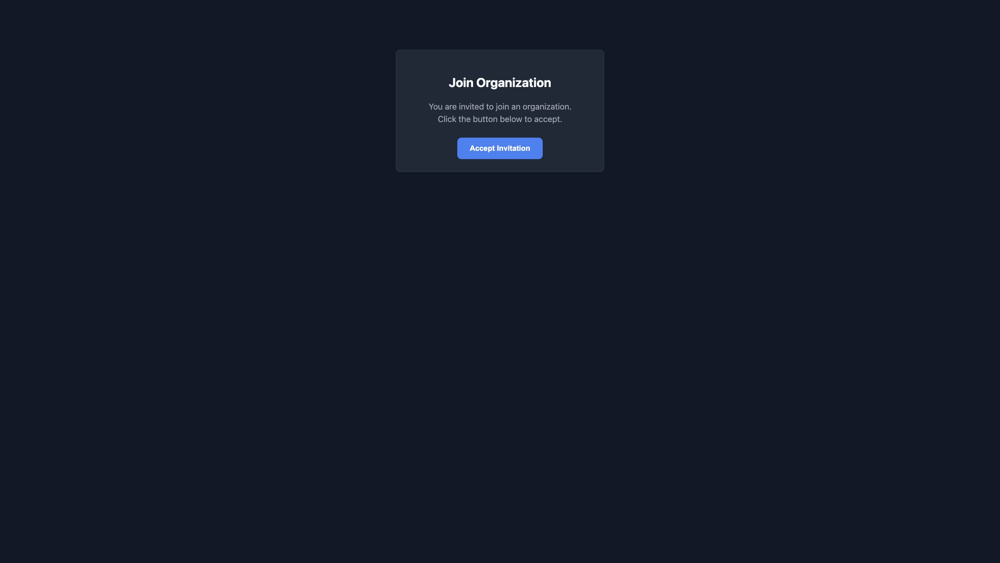

# Enterprise SaaS Starter with Supabase (Multi-tenancy Demo)

A production-ready, type-safe SaaS boilerplate demonstrating **Multi-tenancy**, **Row Level Security (RLS)**, and **Transactional RPCs** using Supabase and React. This project showcases enterprise-grade security patterns where data isolation and access control are enforced at the database layer, not just the application layer.






## 🎯 Project Purpose

This project demonstrates how to build a secure, scalable multi-tenant SaaS application where:
- **Security is enforced at the database level** - Even if frontend code is compromised, users cannot access unauthorized data
- **Complex operations are atomic** - Critical actions like organization creation and member invitations are handled via transactional database functions
- **Type safety is end-to-end** - TypeScript types are automatically generated from the database schema

Perfect for understanding enterprise SaaS architecture patterns, PostgreSQL security best practices, and Supabase implementation strategies.

## 🚀 Overview

This project manages the complete user lifecycle for a multi-tenant SaaS application:
- User authentication and profile management
- Organization creation and management
- Role-based access control (RBAC) with three roles: `owner`, `admin`, `member`
- Secure invitation system with token-based invites
- Member status management (active, suspended, left)

**Key Architectural Decision:** Instead of relying on frontend logic for security, this project enforces all security and data integrity at the **PostgreSQL database layer** using Row Level Security (RLS) policies and stored procedures.

## 🔑 Key Features & Architecture

### 1. Database-Level Security (RLS)

Data isolation is enforced strictly by PostgreSQL policies. Even if the frontend code is compromised or bypassed, a user cannot access data from another organization.

**Implementation Highlights:**
- **Tenant Isolation:** Policies use helper functions like `get_my_org_ids()` to ensure users only see organizations they belong to
- **Role-Based Access Control:** Only `owners` and `admins` can view/manage invitations
- **Security Definer Functions:** Helper functions use `SECURITY DEFINER` to bypass RLS recursion while maintaining security through `set search_path = public`

**Example Policy:**
```sql
create policy "Users can view organizations they belong to"
  on public.organizations for select
  using (id in (select get_my_org_ids()));
```

### 2. Transactional Integrity (RPC)

Complex multi-step operations are handled via **PostgreSQL Functions (RPCs)** to ensure atomicity and prevent race conditions.

**Key Functions:**
- **`create_organization(org_name)`**: Atomically creates an organization AND assigns the creator as 'Owner' in a single transaction
- **`invite_member(target_org_id, invite_email)`**: Verifies permissions server-side before generating an invite token with expiration
- **`accept_invite(invite_token)`**: Securely verifies tokens, updates invite status, and adds members atomically (prevents duplicate memberships)
- **`set_membership_status(target_membership_id, new_status)`**: Includes safety guards to prevent users from changing their own status

**Why RPCs?** These operations require multiple database operations that must succeed or fail together. Using RPCs ensures:
- Atomicity (all-or-nothing execution)
- Server-side permission validation
- Protection against race conditions
- Consistent data state

### 3. Type Safety

- **Supabase CLI:** TypeScript definitions are automatically generated from the database schema
- **End-to-end type safety:** Database schema changes automatically propagate to frontend types
- **Type-safe RPC calls:** All function parameters and return types are fully typed

### 4. Modern Frontend Architecture

- **React 19** with TypeScript for type safety
- **React Router** for client-side routing
- **Protected Routes** with authentication checks
- **Modern CSS** with CSS variables for theming (dark mode ready)
- **Clean component structure** separating pages, components, and utilities

## 🛠 Tech Stack

* **Frontend:**
  - React 19.2.0 (Vite)
  - TypeScript 5.9
  - React Router DOM 7.10
  - CSS Variables (Modern Dark Mode support)
  
* **Backend:**
  - Supabase (PostgreSQL 15+)
  - Supabase Auth
  - Row Level Security (RLS)
  - PostgreSQL Functions (PL/pgSQL)
  
* **Development:**
  - Vite for fast development and building
  - ESLint for code quality
  - Supabase CLI for type generation

## 🗄️ Database Schema

The application uses a relational structure optimized for multi-tenancy:

### Core Tables

* **`profiles`**: Public user data synced automatically with `auth.users` via database triggers
* **`organizations`**: The tenant unit - each organization represents a separate tenant
* **`memberships`**: Junction table linking users to organizations with:
  - **Roles:** `owner`, `admin`, `member`
  - **Statuses:** `invited`, `active`, `suspended`, `left`
  - Unique constraint on `(org_id, user_id)` to prevent duplicates
* **`invites`**: Manages pending invitations with:
  - Secure random tokens
  - Expiration dates (7 days default)
  - Status tracking (`pending`, `accepted`, `expired`)

### Database Functions

* **`get_my_org_ids()`**: Helper function returning organization IDs where the current user is an active member (used in RLS policies)
* **`handle_new_user()`**: Trigger function that automatically creates a profile when a new user signs up

### Indexes

Performance-optimized indexes on:
- `memberships(user_id)` and `memberships(org_id)` for fast lookups
- `invites(token)` for quick invite validation

## 📁 Project Structure

```
├── sql/
│   ├── 01_schema.sql      # Database tables and indexes
│   ├── 02_functions.sql   # Helper functions and triggers
│   ├── 03_rpcs.sql        # Transactional RPC functions
│   └── 04_rls.sql         # Row Level Security policies
├── src/
│   ├── pages/             # Page components
│   │   ├── AuthPage.tsx
│   │   ├── DashboardPage.tsx
│   │   ├── OrganizationPage.tsx
│   │   └── AcceptInvitePage.tsx
│   ├── components/        # Reusable components
│   │   └── ProtectedRoute.tsx
│   ├── auth/              # Authentication context
│   │   └── AuthProvider.tsx
│   ├── lib/               # Utilities
│   │   └── supabaseClient.ts
│   └── types/             # TypeScript types
│       └── database.types.ts  # Auto-generated from Supabase
└── screenshots/           # UI screenshots
```

## 💻 Getting Started

### Prerequisites

* Node.js 18+ 
* A Supabase project ([Create one here](https://supabase.com))

### Installation

1. **Clone the repository:**
   ```bash
   git clone <repository-url>
   cd supabase-saas-user-lifecycle-demo
   ```

2. **Install dependencies:**
   ```bash
   npm install
   ```

3. **Set up your Supabase database:**
   
   In your Supabase project dashboard, go to SQL Editor and run the SQL files in order:
   - `sql/01_schema.sql` - Creates tables and indexes
   - `sql/02_functions.sql` - Creates helper functions and triggers
   - `sql/03_rpcs.sql` - Creates transactional RPC functions
   - `sql/04_rls.sql` - Enables RLS and creates security policies

4. **Set up environment variables:**
   
   Copy `.env.example` to `.env.local`:
   ```bash
   cp .env.example .env.local
   ```
   
   Then edit `.env.local` and fill in your Supabase credentials:
   ```env
   VITE_SUPABASE_URL=your_supabase_project_url
   VITE_SUPABASE_ANON_KEY=your_supabase_anon_key
   ```
   
   You can find these values in your Supabase project settings under API.

5. **Generate TypeScript types (optional but recommended):**
   ```bash
   npx supabase gen types typescript --project-id your_project_id > src/types/database.types.ts
   ```

6. **Run the development server:**
   ```bash
   npm run dev
   ```

7. **Open your browser:**
   
   Navigate to `http://localhost:5173` (or the port shown in your terminal)

### Testing the Application

1. **Sign up** with a new account
2. **Create an organization** from the dashboard
3. **Invite a member** (use a different email address)
4. **Accept the invite** by navigating to `/invites/{token}` with the invite token
5. **Test role-based access** - members cannot see the invite section, only admins/owners can

## 🔒 Security Considerations

This project demonstrates several security best practices:

1. **Database-First Security:** All access control is enforced at the database level, not just the application layer
2. **RLS Policies:** Every table has Row Level Security enabled with appropriate policies
3. **Permission Validation:** RPC functions validate permissions server-side before executing operations
4. **Token-Based Invites:** Secure random tokens with expiration dates for invitations
5. **Transaction Safety:** Critical operations are wrapped in transactions to prevent partial updates
6. **Search Path Security:** Functions use `set search_path = public` to prevent SQL injection

## 🎓 Learning Outcomes

By studying this project, you'll understand:

- How to implement multi-tenancy in PostgreSQL with RLS
- How to design secure, transactional database functions
- How to build type-safe full-stack applications with Supabase
- Enterprise SaaS architecture patterns
- Role-based access control implementation
- Secure invitation and onboarding flows

## 📝 Notes

- This is a **demonstration project** focusing on architecture and security patterns
- For production use, consider adding:
  - Email notifications for invitations
  - Audit logging
  - Rate limiting
  - More comprehensive error handling
  - Unit and integration tests

## 🛡️ License

MIT License - feel free to use this as a starting point for your own projects!